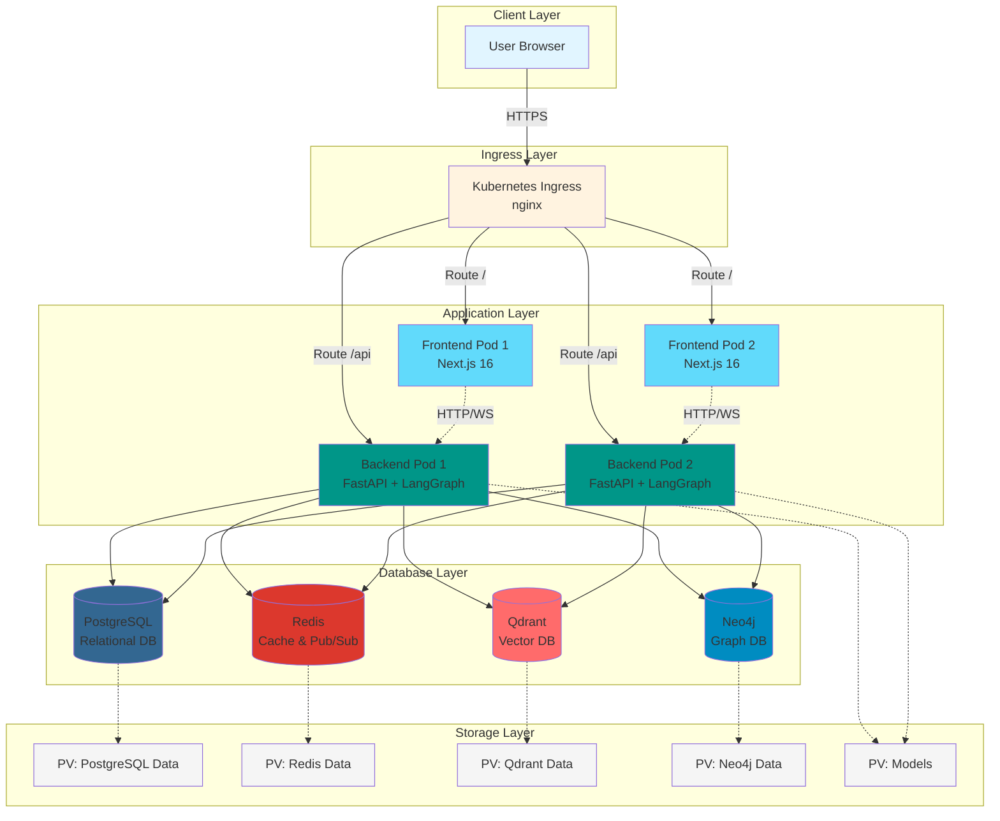
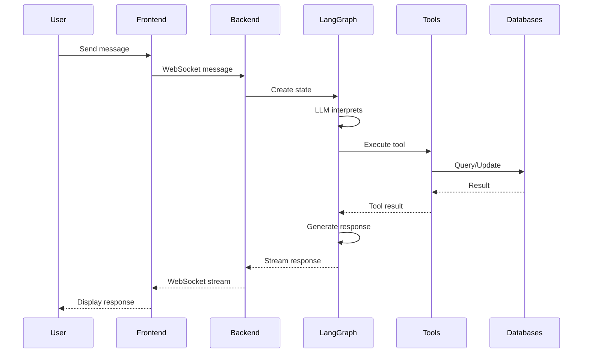
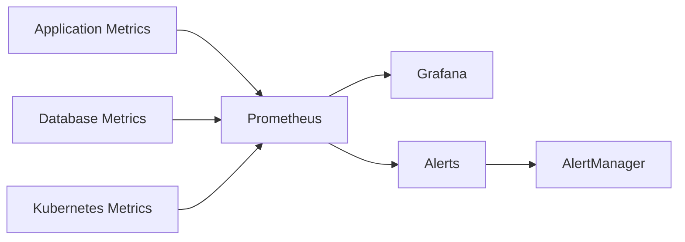

# MoneyMind Finance AI Agent - Architecture Overview

## System Architecture Diagram



## Component Details

### Frontend (Next.js 16)
- **Technology**: React 18 with Next.js 16
- **Deployment**: 2 replicas for high availability
- **Features**:
  - Server-side rendering
  - WebSocket client for real-time chat
  - Chart rendering with Recharts
  - Responsive UI with shadcn/ui

### Backend (FastAPI)
- **Technology**: Python 3.11 with FastAPI
- **Deployment**: 2 replicas with load balancing
- **Features**:
  - LangChain + LangGraph agent system
  - WebSocket support for streaming responses
  - RESTful API endpoints
  - Multi-agent architecture
  - Tool execution framework

### Databases

#### PostgreSQL
- **Purpose**: Primary relational database
- **Storage**: Transactions, expenses, bills, goals, user data
- **Version**: 16 (Alpine)
- **Persistence**: 10GB PVC

#### Redis
- **Purpose**: Caching and Pub/Sub messaging
- **Features**: 
  - Session storage
  - Real-time notifications
  - API response caching
- **Version**: 7 (Alpine)
- **Persistence**: 5GB PVC with AOF

#### Qdrant
- **Purpose**: Vector database for embeddings
- **Features**:
  - Conversation memory
  - Semantic search
  - Document embeddings
- **Version**: Latest
- **Persistence**: 20GB PVC

#### Neo4j
- **Purpose**: Graph database for relationships
- **Features**:
  - Spending pattern analysis
  - Card recommendations
  - Financial relationship mapping
  - APOC and GDS plugins
- **Version**: 5 Community
- **Persistence**: 10GB data + 2GB logs

## Data Flow

### User Request Flow



### Tool Execution Flow

1. **User Input** → Frontend captures message
2. **WebSocket** → Message sent to backend
3. **LangGraph Controller** → Creates execution state
4. **LLM Node** → Interprets intent and selects tool
5. **Tool Node** → Executes specific operation:
   - CRUD operations (PostgreSQL)
   - Exchange rates (External API)
   - Stock prices (External API)
   - Recommendations (Neo4j)
   - Chart generation (Python)
   - Vector search (Qdrant)
6. **Response Generation** → LLM formats response
7. **Stream to Frontend** → Real-time updates
8. **Memory Update** → Store in vector DB and conversation history

## Deployment Architectures

### Docker Compose (Development)

```
┌─────────────────────────────────────────┐
│         Docker Host                     │
│  ┌────────────────────────────────┐    │
│  │   moneymind-network (bridge)   │    │
│  │                                 │    │
│  │  ┌──────┐  ┌──────┐  ┌──────┐ │    │
│  │  │ FE   │  │ BE   │  │ PG   │ │    │
│  │  └──────┘  └──────┘  └──────┘ │    │
│  │  ┌──────┐  ┌──────┐  ┌──────┐ │    │
│  │  │Redis │  │Qdrant│  │Neo4j │ │    │
│  │  └──────┘  └──────┘  └──────┘ │    │
│  └────────────────────────────────┘    │
│                                         │
│  Volumes: postgres_data, redis_data,   │
│           qdrant_data, neo4j_data      │
└─────────────────────────────────────────┘
```

### Kubernetes (Production)

```
┌─────────────────────────────────────────────────┐
│              Kubernetes Cluster                 │
│                                                 │
│  ┌───────────────────────────────────────┐     │
│  │      Namespace: moneymind             │     │
│  │                                       │     │
│  │  ┌─────────────────────────────┐     │     │
│  │  │  Ingress (nginx)            │     │     │
│  │  └─────────────────────────────┘     │     │
│  │           │                           │     │
│  │  ┌────────┴────────┐                 │     │
│  │  │                 │                 │     │
│  │  ▼                 ▼                 │     │
│  │  Frontend Svc    Backend Svc        │     │
│  │  (LoadBalancer)  (ClusterIP)        │     │
│  │  │                 │                 │     │
│  │  ▼                 ▼                 │     │
│  │  FE Pods (x2)    BE Pods (x2)       │     │
│  │                    │                 │     │
│  │  ┌─────────────────┴──────────┐     │     │
│  │  │                            │     │     │
│  │  ▼          ▼        ▼        ▼     │     │
│  │  PG Svc   Redis   Qdrant   Neo4j   │     │
│  │  │         │        │        │      │     │
│  │  ▼         ▼        ▼        ▼      │     │
│  │  PG Pod   RD Pod   QD Pod   N4J Pod │     │
│  │  │         │        │        │      │     │
│  │  ▼         ▼        ▼        ▼      │     │
│  │  PVC       PVC      PVC      PVC    │     │
│  └───────────────────────────────────────┘     │
└─────────────────────────────────────────────────┘
```

## Resource Requirements

### Minimum (Development)
- **CPU**: 4 cores
- **RAM**: 8GB
- **Storage**: 50GB

### Recommended (Production)
- **CPU**: 8+ cores
- **RAM**: 16GB+
- **Storage**: 100GB+

### Per Service (Kubernetes)

| Service | CPU Request | CPU Limit | Memory Request | Memory Limit | Storage |
|---------|-------------|-----------|----------------|--------------|---------|
| Frontend | 250m | 1000m | 256Mi | 1Gi | - |
| Backend | 500m | 2000m | 1Gi | 4Gi | 15Gi (models) |
| PostgreSQL | 250m | 1000m | 256Mi | 1Gi | 10Gi |
| Redis | 100m | 500m | 128Mi | 512Mi | 5Gi |
| Qdrant | 250m | 1000m | 512Mi | 2Gi | 20Gi |
| Neo4j | 500m | 2000m | 1Gi | 4Gi | 12Gi |

## Security Considerations

1. **Secrets Management**
   - All passwords stored in Kubernetes Secrets
   - Environment variables for sensitive data
   - No hardcoded credentials

2. **Network Security**
   - Internal services use ClusterIP
   - Only frontend exposed via LoadBalancer
   - TLS/SSL via Ingress

3. **Database Security**
   - Password-protected databases
   - Network isolation
   - Encrypted connections

4. **Container Security**
   - Non-root user for frontend
   - Minimal base images (Alpine)
   - Regular security updates

## Scalability

### Horizontal Scaling

```bash
# Scale frontend
kubectl scale deployment frontend --replicas=5 -n moneymind

# Scale backend
kubectl scale deployment backend --replicas=5 -n moneymind
```

### Vertical Scaling

Adjust resource limits in deployment YAML files.

### Database Scaling

- **PostgreSQL**: Consider read replicas
- **Redis**: Consider Redis Cluster
- **Qdrant**: Supports distributed mode
- **Neo4j**: Consider Enterprise for clustering

## High Availability

- **Frontend**: 2+ replicas with load balancing
- **Backend**: 2+ replicas with load balancing
- **Databases**: Single instance (consider HA solutions for production)
- **Storage**: Persistent volumes with backup strategy

## Monitoring Stack (Optional)



## Backup Strategy

1. **PostgreSQL**: Daily pg_dump
2. **Neo4j**: Daily database dump
3. **Qdrant**: Snapshot API
4. **Redis**: AOF + RDB persistence
5. **Volumes**: Kubernetes volume snapshots

---

**Last Updated**: 2025-12-08
