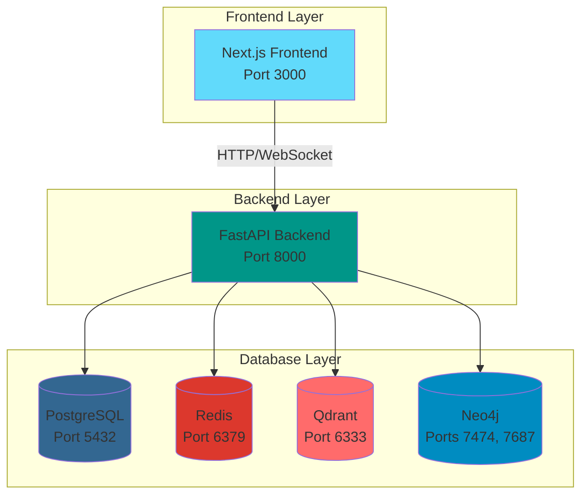

# MoneyMind Finance AI Agent - Docker & Kubernetes Infrastructure

## 📋 Table of Contents

- [Overview](#overview)
- [Architecture](#architecture)
- [Prerequisites](#prerequisites)
- [Docker Setup](#docker-setup)
- [Kubernetes Setup](#kubernetes-setup)
- [Configuration](#configuration)
- [Deployment](#deployment)
- [Monitoring & Maintenance](#monitoring--maintenance)
- [Troubleshooting](#troubleshooting)

---

## 🎯 Overview

MoneyMind Finance AI Agent is a production-ready personal finance AI assistant built with:

- **Backend**: FastAPI with LangChain + LangGraph
- **Frontend**: Next.js 16
- **Databases**: PostgreSQL, Redis, Qdrant (Vector DB), Neo4j (Graph DB)
- **AI/ML**: Local LLM models (Gemma 3 / Phi 4 Mini / Qwen 1.5B)

This infrastructure supports both Docker Compose (development) and Kubernetes (production) deployments.

---

## 🏗️ Architecture



### Service Ports

| Service    | Port(s)      | Purpose                          |
|------------|--------------|----------------------------------|
| Frontend   | 3000         | Next.js web interface            |
| Backend    | 8000         | FastAPI REST + WebSocket API     |
| PostgreSQL | 5432         | Relational database              |
| Redis      | 6379         | Cache & Pub/Sub                  |
| Qdrant     | 6333, 6334   | Vector database (HTTP, gRPC)     |
| Neo4j      | 7474, 7687   | Graph database (HTTP, Bolt)      |

---

## 📦 Prerequisites

### For Docker Deployment

- Docker Engine 24.0+
- Docker Compose 2.20+
- Minimum 8GB RAM
- 50GB free disk space

### For Kubernetes Deployment

- Kubernetes cluster 1.28+
- kubectl configured
- Minimum 16GB RAM across cluster
- 100GB storage available
- Optional: Ingress controller (nginx)
- Optional: cert-manager for TLS

---

## 🐳 Docker Setup

### Quick Start

1. **Clone the repository**
   ```bash
   cd /home/azad/Documents/moneymind-finance-ai-agent
   ```

2. **Configure environment variables**
   
   Edit `docker-compose.yml` and update:
   - Database passwords
   - API keys (ExchangeRate, AlphaVantage)
   - Secret keys

3. **Build and start services**
   ```bash
   docker-compose up -d
   ```

4. **Check service health**
   ```bash
   docker-compose ps
   docker-compose logs -f
   ```

5. **Access the application**
   - Frontend: http://localhost:3000
   - Backend API: http://localhost:8000
   - API Docs: http://localhost:8000/docs
   - Neo4j Browser: http://localhost:7474

### Individual Service Management

```bash
# Start specific service
docker-compose up -d postgres

# View logs
docker-compose logs -f backend

# Restart service
docker-compose restart backend

# Stop all services
docker-compose down

# Stop and remove volumes (⚠️ deletes data)
docker-compose down -v
```

### Building Images

```bash
# Build backend
docker-compose build backend

# Build frontend
docker-compose build frontend

# Build all
docker-compose build
```

---

## ☸️ Kubernetes Setup

### Prerequisites Check

```bash
# Verify kubectl
kubectl version --client

# Check cluster access
kubectl cluster-info

# Verify storage class
kubectl get storageclass
```

### Deployment Steps

#### 1. Create Namespace

```bash
kubectl apply -f k8s/00-namespace.yaml
```

#### 2. Configure Secrets

**⚠️ IMPORTANT**: Update secrets before deploying!

```bash
# Edit secrets file
nano k8s/02-secrets.yaml

# Or create secrets via kubectl
kubectl create secret generic moneymind-secrets \
  --namespace=moneymind \
  --from-literal=POSTGRES_PASSWORD='your-secure-password' \
  --from-literal=REDIS_PASSWORD='your-redis-password' \
  --from-literal=NEO4J_PASSWORD='your-neo4j-password' \
  --from-literal=SECRET_KEY='your-app-secret-key' \
  --from-literal=EXCHANGE_RATE_API_KEY='your-api-key' \
  --from-literal=ALPHA_VANTAGE_API_KEY='your-api-key'
```

#### 3. Deploy Infrastructure

```bash
# Apply all configurations in order
kubectl apply -f k8s/01-configmap.yaml
kubectl apply -f k8s/02-secrets.yaml
kubectl apply -f k8s/03-pvcs.yaml

# Deploy databases
kubectl apply -f k8s/04-postgres.yaml
kubectl apply -f k8s/05-redis.yaml
kubectl apply -f k8s/06-qdrant.yaml
kubectl apply -f k8s/07-neo4j.yaml

# Wait for databases to be ready
kubectl wait --for=condition=ready pod -l app=postgres -n moneymind --timeout=300s
kubectl wait --for=condition=ready pod -l app=redis -n moneymind --timeout=300s
kubectl wait --for=condition=ready pod -l app=qdrant -n moneymind --timeout=300s
kubectl wait --for=condition=ready pod -l app=neo4j -n moneymind --timeout=300s
```

#### 4. Build and Push Images

```bash
# Build backend image
cd backend
docker build -t moneymind-backend:latest .

# Build frontend image
cd ../frontend
docker build -t moneymind-frontend:latest .

# If using a registry, tag and push
docker tag moneymind-backend:latest your-registry/moneymind-backend:latest
docker push your-registry/moneymind-backend:latest

docker tag moneymind-frontend:latest your-registry/moneymind-frontend:latest
docker push your-registry/moneymind-frontend:latest
```

#### 5. Deploy Applications

```bash
# Deploy backend and frontend
kubectl apply -f k8s/08-backend.yaml
kubectl apply -f k8s/09-frontend.yaml

# Wait for applications
kubectl wait --for=condition=ready pod -l app=backend -n moneymind --timeout=300s
kubectl wait --for=condition=ready pod -l app=frontend -n moneymind --timeout=300s
```

#### 6. Optional: Setup Ingress

```bash
# Install nginx ingress controller (if not already installed)
kubectl apply -f https://raw.githubusercontent.com/kubernetes/ingress-nginx/controller-v1.9.4/deploy/static/provider/cloud/deploy.yaml

# Update domain in ingress.yaml
nano k8s/10-ingress.yaml

# Apply ingress
kubectl apply -f k8s/10-ingress.yaml
```

### Verification

```bash
# Check all resources
kubectl get all -n moneymind

# Check pod status
kubectl get pods -n moneymind

# Check services
kubectl get svc -n moneymind

# Check persistent volumes
kubectl get pvc -n moneymind

# View logs
kubectl logs -f deployment/backend -n moneymind
kubectl logs -f deployment/frontend -n moneymind
```

### Access the Application

```bash
# Get frontend service external IP (LoadBalancer)
kubectl get svc frontend-service -n moneymind

# Or use port-forward for testing
kubectl port-forward svc/frontend-service 3000:80 -n moneymind
kubectl port-forward svc/backend-service 8000:8000 -n moneymind
```

---

## ⚙️ Configuration

### Environment Variables

#### Backend Configuration

| Variable | Description | Default |
|----------|-------------|---------|
| `DATABASE_URL` | PostgreSQL connection string | - |
| `REDIS_URL` | Redis connection string | - |
| `QDRANT_URL` | Qdrant endpoint | http://qdrant:6333 |
| `NEO4J_URI` | Neo4j Bolt URI | bolt://neo4j:7687 |
| `NEO4J_USER` | Neo4j username | neo4j |
| `NEO4J_PASSWORD` | Neo4j password | - |
| `SECRET_KEY` | Application secret key | - |
| `MODEL_NAME` | LLM model name | gemma-3-2b |
| `EXCHANGE_RATE_API_KEY` | ExchangeRate API key | - |
| `ALPHA_VANTAGE_API_KEY` | AlphaVantage API key | - |

#### Frontend Configuration

| Variable | Description | Default |
|----------|-------------|---------|
| `NEXT_PUBLIC_API_URL` | Backend API URL | http://backend:8000 |
| `NEXT_PUBLIC_WS_URL` | WebSocket URL | ws://backend:8000 |
| `NODE_ENV` | Node environment | production |

### Database Credentials

**⚠️ Security Warning**: Change all default passwords in production!

Default credentials (Docker Compose):
- PostgreSQL: `moneymind_user` / `moneymind_secure_password_2024`
- Redis: `moneymind_redis_password_2024`
- Neo4j: `neo4j` / `moneymind_neo4j_password_2024`

---

## 🚀 Deployment

### Development (Docker Compose)

```bash
# Start all services
docker-compose up -d

# View logs
docker-compose logs -f

# Access services
# Frontend: http://localhost:3000
# Backend: http://localhost:8000/docs
# Neo4j: http://localhost:7474
```

### Production (Kubernetes)

```bash
# Deploy everything
./scripts/deploy-k8s.sh

# Or manually
kubectl apply -f k8s/

# Scale applications
kubectl scale deployment backend --replicas=3 -n moneymind
kubectl scale deployment frontend --replicas=3 -n moneymind
```

### CI/CD Integration

Example GitHub Actions workflow:

```yaml
name: Deploy to Kubernetes

on:
  push:
    branches: [main]

jobs:
  deploy:
    runs-on: ubuntu-latest
    steps:
      - uses: actions/checkout@v3
      
      - name: Build images
        run: |
          docker build -t ${{ secrets.REGISTRY }}/backend:${{ github.sha }} ./backend
          docker build -t ${{ secrets.REGISTRY }}/frontend:${{ github.sha }} ./frontend
      
      - name: Push images
        run: |
          docker push ${{ secrets.REGISTRY }}/backend:${{ github.sha }}
          docker push ${{ secrets.REGISTRY }}/frontend:${{ github.sha }}
      
      - name: Deploy to K8s
        run: |
          kubectl set image deployment/backend backend=${{ secrets.REGISTRY }}/backend:${{ github.sha }} -n moneymind
          kubectl set image deployment/frontend frontend=${{ secrets.REGISTRY }}/frontend:${{ github.sha }} -n moneymind
```

---

## 📊 Monitoring & Maintenance

### Health Checks

```bash
# Docker Compose
docker-compose ps
curl http://localhost:8000/health

# Kubernetes
kubectl get pods -n moneymind
kubectl describe pod <pod-name> -n moneymind
```

### Logs

```bash
# Docker Compose
docker-compose logs -f backend
docker-compose logs -f frontend

# Kubernetes
kubectl logs -f deployment/backend -n moneymind
kubectl logs -f deployment/frontend -n moneymind
kubectl logs -f deployment/postgres -n moneymind
```

### Database Backups

#### PostgreSQL Backup

```bash
# Docker Compose
docker-compose exec postgres pg_dump -U moneymind_user moneymind > backup.sql

# Kubernetes
kubectl exec -it deployment/postgres -n moneymind -- pg_dump -U moneymind_user moneymind > backup.sql
```

#### Neo4j Backup

```bash
# Docker Compose
docker-compose exec neo4j neo4j-admin database dump neo4j --to-path=/backups

# Kubernetes
kubectl exec -it deployment/neo4j -n moneymind -- neo4j-admin database dump neo4j --to-path=/backups
```

### Resource Monitoring

```bash
# Kubernetes resource usage
kubectl top nodes
kubectl top pods -n moneymind

# Docker resource usage
docker stats
```

---

## 🔧 Troubleshooting

### Common Issues

#### 1. Services Not Starting

```bash
# Check logs
docker-compose logs <service-name>
kubectl logs -f deployment/<service-name> -n moneymind

# Check resource constraints
docker stats
kubectl describe pod <pod-name> -n moneymind
```

#### 2. Database Connection Errors

```bash
# Verify database is running
docker-compose ps postgres
kubectl get pods -l app=postgres -n moneymind

# Test connection
docker-compose exec backend python -c "from sqlalchemy import create_engine; engine = create_engine('postgresql://...'); print(engine.connect())"
```

#### 3. Out of Memory

```bash
# Increase Docker memory limit (Docker Desktop)
# Settings > Resources > Memory

# Kubernetes: adjust resource limits in deployment files
kubectl edit deployment backend -n moneymind
```

#### 4. Volume Permission Issues

```bash
# Fix permissions
sudo chown -R 1001:1001 /path/to/volume

# Or run container as root (not recommended for production)
```

#### 5. Image Pull Errors (Kubernetes)

```bash
# Check image exists
docker images | grep moneymind

# Create image pull secret if using private registry
kubectl create secret docker-registry regcred \
  --docker-server=<registry> \
  --docker-username=<username> \
  --docker-password=<password> \
  -n moneymind

# Update deployment to use secret
kubectl patch serviceaccount default -p '{"imagePullSecrets": [{"name": "regcred"}]}' -n moneymind
```

### Debug Commands

```bash
# Docker Compose
docker-compose config  # Validate compose file
docker-compose ps      # Service status
docker-compose top     # Running processes

# Kubernetes
kubectl get events -n moneymind  # Recent events
kubectl describe pod <pod-name> -n moneymind  # Pod details
kubectl exec -it <pod-name> -n moneymind -- /bin/sh  # Shell access
```

### Performance Tuning

1. **PostgreSQL**: Adjust `shared_buffers`, `work_mem` in postgres config
2. **Redis**: Enable persistence, adjust `maxmemory-policy`
3. **Neo4j**: Tune heap size and page cache
4. **Backend**: Increase Uvicorn workers
5. **Frontend**: Enable Next.js caching

---

## 📚 Additional Resources

- [FastAPI Documentation](https://fastapi.tiangolo.com/)
- [Next.js Documentation](https://nextjs.org/docs)
- [LangChain Documentation](https://python.langchain.com/)
- [Docker Compose Reference](https://docs.docker.com/compose/)
- [Kubernetes Documentation](https://kubernetes.io/docs/)

---

## 🤝 Support

For issues and questions:
1. Check the [Troubleshooting](#troubleshooting) section
2. Review logs for error messages
3. Consult service-specific documentation

---

**Last Updated**: 2025-12-08
