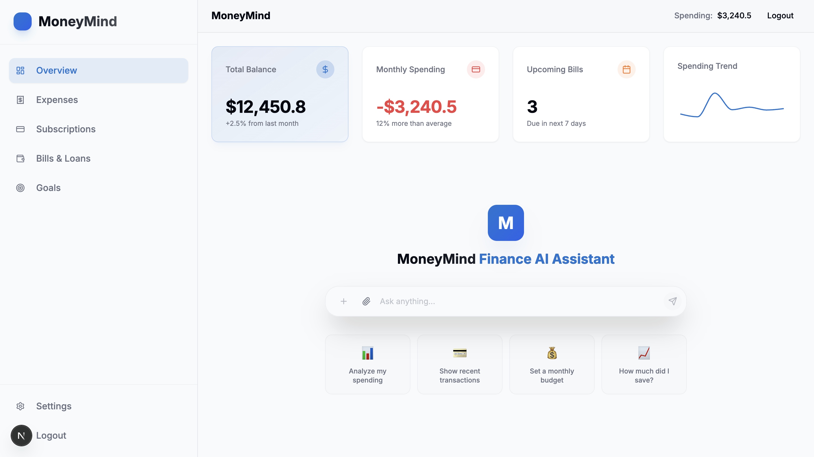

# **MoneyMind — Personal Finance AI Assistant**

MoneyMind is a modern AI-powered financial assistant designed to handle expenses, budgets, subscriptions, currency conversions, and real-time financial intelligence through natural language.

This backend provides the entire **AI + tools + data + API integration** layer that powers MoneyMind.

---


## Overview

MoneyMind turns a simple chat interface into a powerful financial engine. Users can ask:

* “Convert 1200 THB to USD”
* “Track this month’s spending by category”
* “Add Netflix subscription at 499 THB”
* “Show me Tesla’s current stock price”
* “What were my biggest expenses this week?”

The backend handles everything automatically:

1. Understand intent
2. Query the knowledge graph
3. Execute tools in a sandbox
4. Fetch external API data
5. Generate structured JSON and chart data for the UI

---

## Architecture

MoneyMind is built on **clean architecture + LangGraph orchestration** with a hybrid tool execution model.

### **High-Level Flow**

```
User → Chat Message  
     ↓  
Intent & Entities Extraction  
     ↓  
Neo4j → Maps Intent → Required Tool  
     ↓  
sandbox-mcp → Secure Tool Execution  
     ↓  
External APIs (ExchangeRateAPI, AlphaVantage)  
     ↓  
Response formatting (JSON + chart metadata)  
     ↓  
Returned to frontend UI
```

Everything is event-driven and designed for real-time visual updates.

```markdown
→ “I spent 3,200 baht on street food in Bangkok today”
→ AI creates expense, updates monthly chart in chat + sidebar widget turns red

→ “Show me my spending by category this month as a pie chart”
→ AI instantly injects a live Recharts pie chart into the chat stream

→ “Add Netflix 499 ฿ every 7th of the month”
→ New subscription appears in sidebar + reminder card + chart updates

→ “What bills are due in the next 10 days?”
→ AI replies with a beautiful table + highlights upcoming bills in sidebar

→ “Can I afford a 150,000 ฿ MacBook if I buy it in 3 months?”
→ AI runs forecast from your income/expenses → shows projection line chart + yes/no with confidence
```

---

## 🔥 Core Features

### **1. Natural Language Finance Control**

Users control all financial actions via chat:

* Create expenses
* List expenses
* Add subscriptions
* Track bills
* Check loans
* Forecast monthly spending
* Convert currencies
* Get live stock prices

No buttons.
No menus.
Only chat.

---

### **2. Knowledge Graph Reasoning (Neo4j)**

Neo4j acts as the “brain” of the system.

It stores:

* **Intents** (currency_conversion, create_expense, get_stock_price, etc.)
* **Tools** (expense_tool, exchange_tool, stock_tool, forecast_tool)
* **API nodes** (AlphaVantage, ExchangeRateAPI)
* **Relationships** (intent → tool → API)

This allows the system to:

* Automatically pick the right tool
* Chain tools intelligently
* Plan multi-step actions

---

### **3. Tool Execution Inside sandbox-mcp**

MoneyMind uses:

👉 [https://github.com/pottekkat/sandbox-mcp](https://github.com/pottekkat/sandbox-mcp)

Every tool runs in a **fully isolated environment**:

* No direct access to file system
* No outgoing network unless allowed
* No Python code injection risks
* Sandboxed execution per request

This is perfect for handling finance-related operations.

---

### **4. Real-Time External Data Integrations**

MoneyMind uses two major APIs:

#### **A. ExchangeRate-API**

[https://www.exchangerate-api.com/docs/overview](https://www.exchangerate-api.com/docs/overview)

* Currency conversion
* Historical exchange rates
* Multi-currency calculations

#### **B. AlphaVantage Stock API**

[https://www.alphavantage.co/documentation/](https://www.alphavantage.co/documentation/)

* Live stock prices
* Historical time series data
* Technical indicators
* Cryptocurrency data

---

### **5. LangGraph-Based Agent**

The backend includes a full agent orchestration layer:

* Intent parsing
* State management
* Persistent threads
* Tool routing
* Multi-turn reasoning

This makes the AI behave like a personal financial manager with memory.

---

### **6. Clean Architecture (Modular, Extensible)**

```
backend/
  src/
    domain/          # Entities (Expense, Subscription, Bill, CurrencyResult)
    application/     # Use cases, services, orchestrators
    infrastructure/  # APIs (ExchangeRate, AlphaVantage), Neo4j, tool adapters
    interfaces/      # FastAPI routes + WebSocket endpoint
```

No components know about UI — the backend is fully isolated.

---

## 🔩 Technologies Used

### **Backend**

* Python 3.12
* FastAPI
* LangGraph
* Pydantic v2

### **Infrastructure**

* Neo4j
* Docker
* Redis (optional for caching/real-time)

### **API Integrations**

* ExchangeRateAPI
* AlphaVantage

### **Sandbox Execution**

* sandbox-mcp

---

## 🛠️ Main Backend Components

### **1. Intent Parser**

Extracts what user wants:

```text
“convert 100 USD to EUR” → intent: currency_conversion
“add expense 300 dinner” → intent: create_expense
“price of AAPL today”    → intent: stock_price
```

---

### **2. Tool Registry**

Tools are defined with metadata:

* Name
* Description
* Expected inputs
* Neo4j relationships

Examples:

* `currency_conversion_tool`
* `stock_price_tool`
* `create_expense_tool`
* `list_expenses_tool`
* `forecast_tool`

---

### **3. Neo4j Router**

Chooses the correct tool using graph queries:

```
MATCH (i:Intention {name:"currency_conversion"})-[:USES]->(t:Tool)
RETURN t
```

---

### **4. Sandbox Executor**

Executes tools via sandbox-mcp:

```python
response = sandbox.run(tool_name, args)
```

This isolates user logic from system logic.

---

### **5. External API Clients**

* ExchangeRateClient
* AlphaVantageClient

Each wrapped for easy mocking and extension.

---

### **6. Output Formatter**

Returns:

* JSON
* Tables
* Chart metadata (line chart, pie chart, bar chart)

Example response:

```json
{
  "type": "chart",
  "chart": {
    "kind": "line",
    "data": {
      "labels": ["2024-01","2024-02"],
      "values": [1200,1400]
    }
  }
}
```

---

## 🚀 Getting Started

### **1. Clone repository**

```bash
git clone https://github.com/yourname/moneymind-backend
cd moneymind-backend
```

### **2. Setup environment**

```bash
python -m venv venv
source venv/bin/activate
pip install -r requirements.txt
```

### **3. Set environment variables**

`.env` example:

```
NEO4J_URI=bolt://localhost:7687
NEO4J_USER=neo4j
NEO4J_PASSWORD=yourpassword

EXCHANGE_RATE_API_KEY=xxxxx
ALPHAVANTAGE_API_KEY=xxxxx

SANDBOX_URL=http://localhost:8001
```

### **4. Run Neo4j**

```bash
docker run -p 7474:7474 -p 7687:7687 neo4j
```

### **5. Run sandbox**

```bash
docker compose up sandbox
```

### **6. Start FastAPI**

```bash
uvicorn src.interfaces.api:app --reload
```

---

## 🧱 Roadmap

* Expense forecasting (ML-based)
* Subscription detection from transactions
* Stock watchlist
* Financial summarization with charts
* Notifications + email reports
